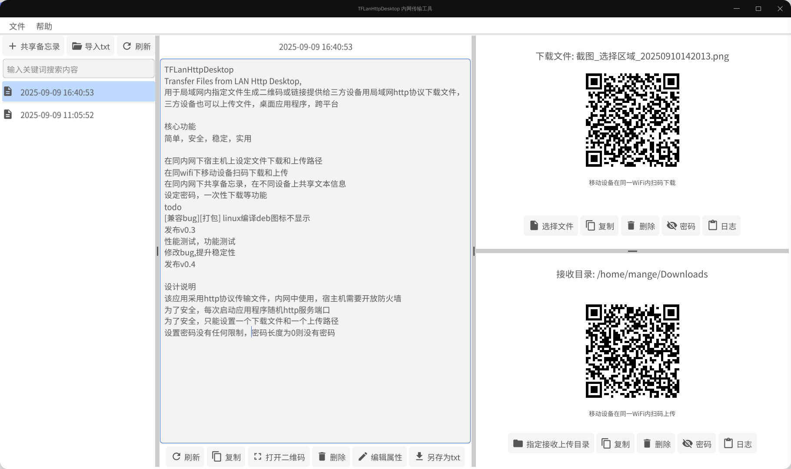
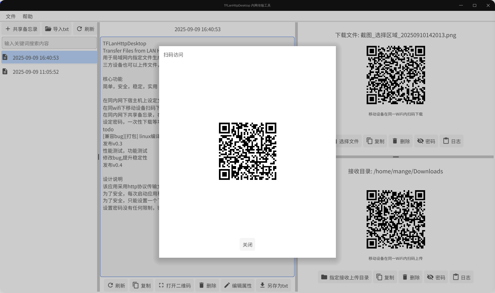
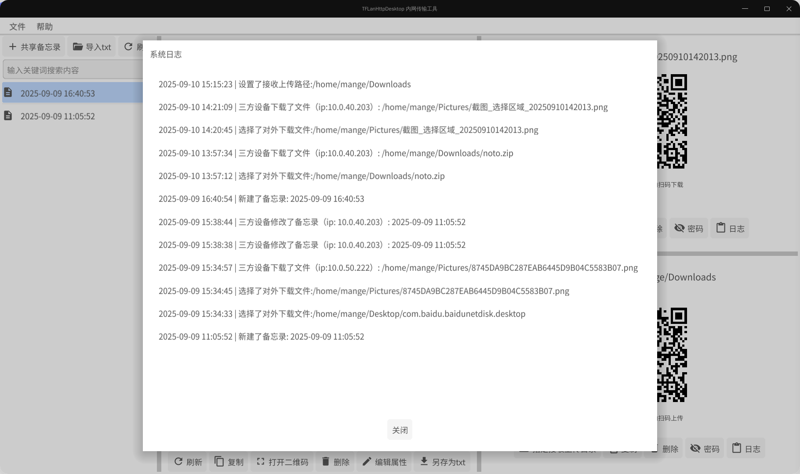
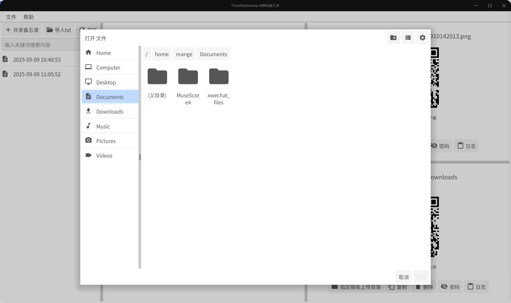
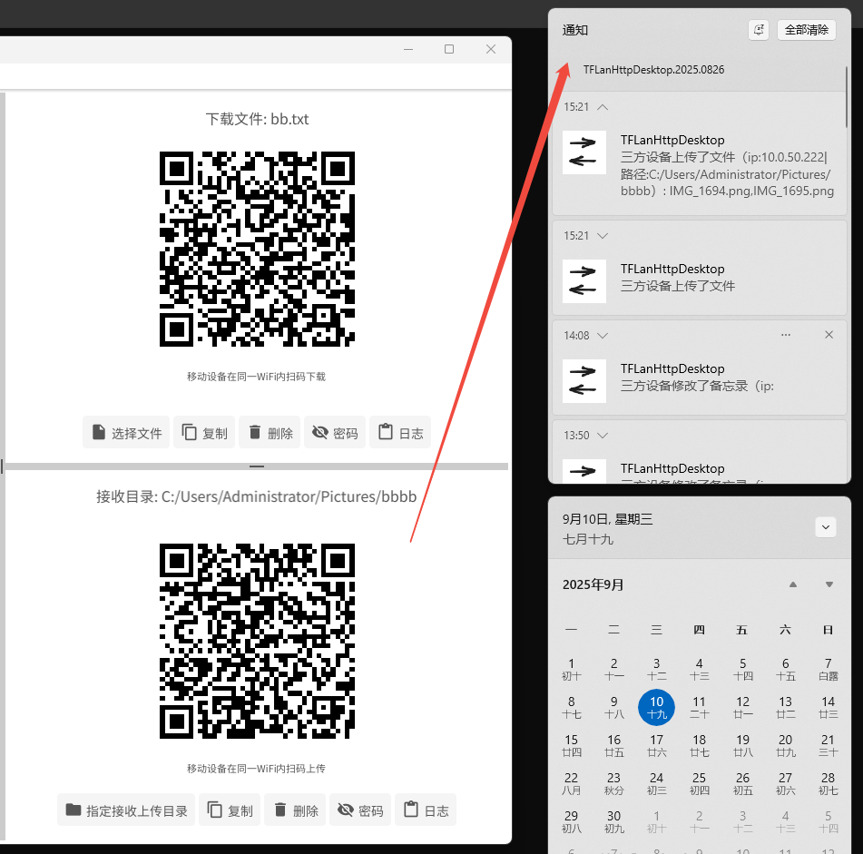
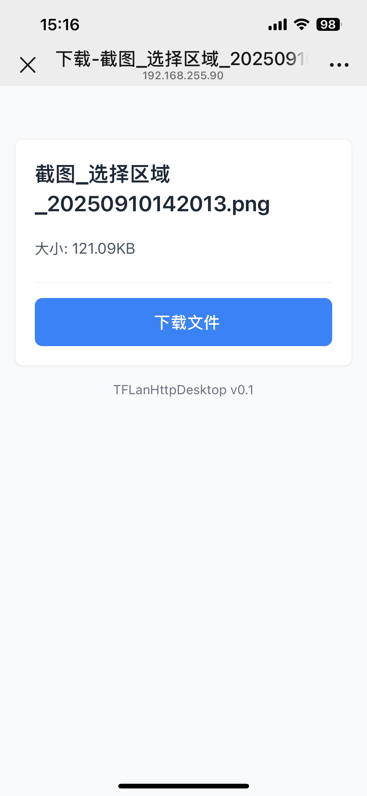
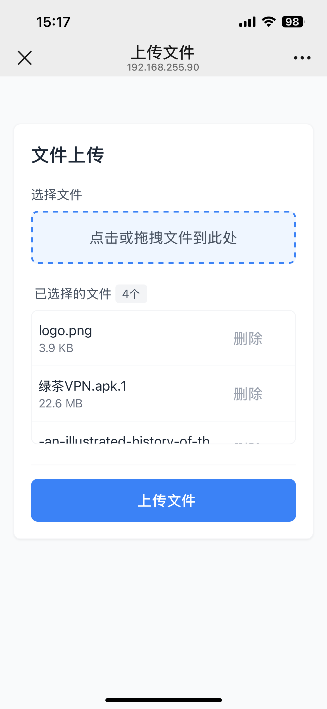

# TFLanHttpDesktop
Transfer Files from LAN Http Desktop, 用于局域网内指定文件生成二维码或链接提供给三方设备用局域网http协议下载文件，三方设备也可以上传文件，桌面应用程序，跨平台

#### 核心功能

简单，安全，稳定，实用

- 在同内网下宿主机上设定文件下载和上传路径
- 在同wifi下移动设备扫码下载和上传
- 在同内网下共享备忘录，在不同设备上共享文本信息
- 设定密码，一次性下载等功能

### 软件截图















#### todo
- [兼容bug][打包] linux编译deb图标不显示
- 发布v0.3
- 性能测试，功能测试
- 修改bug,提升稳定性
- 发布v0.4

## 设计说明
1. 该应用采用http协议传输文件，内网中使用，宿主机需要开放防火墙
2. 为了安全，每次启动应用程序随机http服务端口
3. 为了安全，只能设置一个下载文件和一个上传路径
4. 设置密码没有任何限制，密码长度为0则没有密码

## 里程碑规划
v0.1 基础功能
v0.2 优化现有功能
v0.3 跨系统测试，提升兼容性
v0.4 修改bug,稳定版本,并申请应用市场
v0.5 新需求,待续...

## 问题

#### linux 非root用户运行中文乱码
```
非root用户系统字体文件没有权限，需要通过root用户提升权限

如:  /usr/share/fonts/opentype/noto/NotoSansCJK-Bold.ttc 没有权限

sudo chmod 777 /usr/share/fonts/opentype/noto/ -R
or
sudo chmod 777 /usr/share/fonts/opentype/noto/NotoSansCJK-Bold.ttc

```


## 体验与测试


## fyne 2.6 局限性
- 弹出层的聚焦会夺去输入框的聚焦，无法做到输入弹出联动框
- 底层私有了语言，外部无法直接操作选择语言，语言跟系统一致
- dialog createInformationDialog 私有，无法做到更灵活的定制化
- 系统托盘无法将缩小进行打开
- github.com/go-gl/gl go mod 依赖不兼容导致拉包失败
- 新老版本方法差距太大，市面上资料和文档老版本偏多
- windows上交叉编译linux,darwin环境不好搭建
- linux普通用户扫不到系统的中文字体文件，或者根本就没有中文字体
- linux deepin 下编译，非root下中文乱码（无解决方案？？）
- 

## build
export GOOS=windows
export GOARCH=amd64
export CGO_ENABLED=1
/d/go/bin/fyne.exe package -os windows -icon ./icon.png -app-id "TFLanHttpDesktop.2025.0826" -app-version 0.1.1
CertUtil -hashfile "TFLanHttpDesktop-v0.1.1-linux-amd64.tar.xz" SHA256
TFLanHttpDesktop-v0.1.1-windows-amd64.zip.sha256


export GOOS=linux
export GOARCH=amd64
export CGO_ENABLED=1
/d/go/bin/fyne.exe package -os linux -icon ./icon.png -app-id TFLanHttpDesktop.2025.0826 -app-version 0.1.1

set GOARCH=arm64
/d/go/bin/fyne.exe package -os windows -icon ./icon.png -app-id TFLanHttpDesktop.2025.0826 -app-version 0.1.1
/d/go/bin/fyne.exe package -os linux -icon ./icon.png -app-id TFLanHttpDesktop.2025.0826 -app-version 0.1.1
TFLanHttpDesktop-v0.1.1-windows-arm64.zip TFLanHttpDesktop-v0.1.1-windows-arm64.zip.sha256

需要在苹果系统上打包
fyne package -os darwin -icon ./icon.png -app-id TFLanHttpDesktop.2025.0826 -app-version 0.1.1
fyne package -os darwin -icon ./icon.png -app-id TFLanHttpDesktop.2025.0826 -app-version 0.1.1

## 编译deb

1.
​​创建打包目录结构​​

在你的项目目录外，创建一个用于打包的临时文件夹（例如 deb-package），并建立符合 Debian 标准的子目录：

mkdir -p deb-package/DEBIAN
mkdir -p deb-package/usr/local/bin
mkdir -p deb-package/usr/share/applications
mkdir -p deb-package/usr/share/icons/hicolor/256x256/apps
•
将之前编译好的 Fyne 可执行文件 your-app-name复制到 deb-package/usr/local/bin/目录下。

•
准备一个 256x256 像素的 PNG 图标（如 myapp.png），复制到 deb-package/usr/share/icons/hicolor/256x256/apps/目录下。


2.
​​创建 DEBIAN/control 文件​​

这是软件包的核心元数据文件，告诉包管理器关于这个软件的信息。

touch deb-package/DEBIAN/control
用文本编辑器编辑 deb-package/DEBIAN/control文件，内容参考如下：

Package: your-app-name
Version: 1.0.0
Section: base
Priority: optional
Architecture: amd64
Depends: libgl1, libx11-6, libxrandr2, libxcursor1, libxi6, libxinerama1 # Fyne 运行所需的一些基础图形库依赖
Maintainer: Your Name <you@example.com>
Description: A short description of your awesome Fyne app.
This is a more detailed description that can span multiple lines.
Each new line must start with a space.
3.
​​（可选）创建桌面菜单项 .desktop 文件​​

为了让你的应用出现在系统应用菜单中，创建 deb-package/usr/share/applications/your-app-name.desktop：

[Desktop Entry]
Version=1.0
Type=Application
Name=Your App Name
Comment=A short comment about your app
Exec=/usr/local/bin/your-app-name
Icon=myapp # 注意这里不需要扩展名，指向你放在 icons 目录下的文件名
Categories=Utility; # 参考 https://standards.freedesktop.org/menu-spec/latest/apa.html
Terminal=false
StartupWMClass=Your-App-Name
4.
​​构建 .deb 包​​

在 deb-package的父目录下运行：

dpkg-deb --build deb-package
完成后会生成 deb-package.deb文件。你可以使用 dpkg -i deb-package.deb安装它
